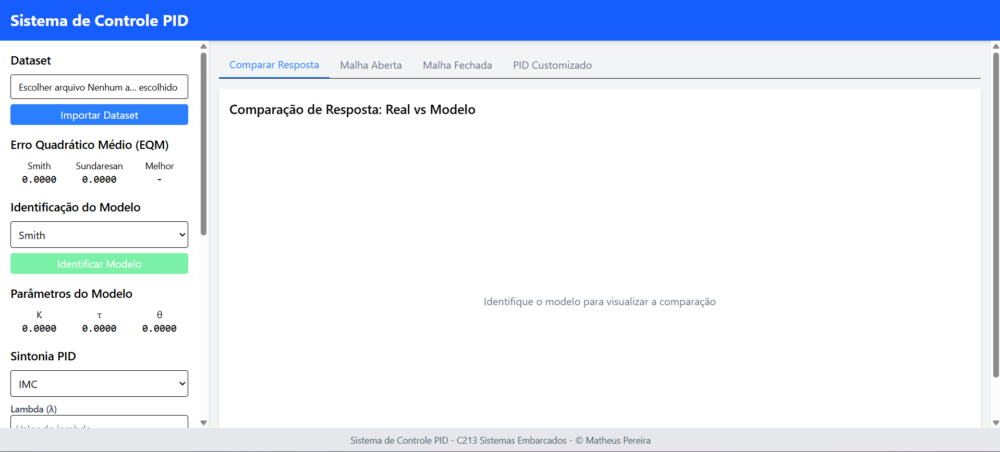
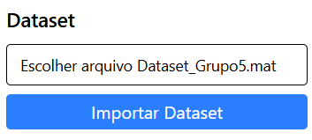
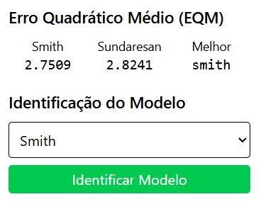
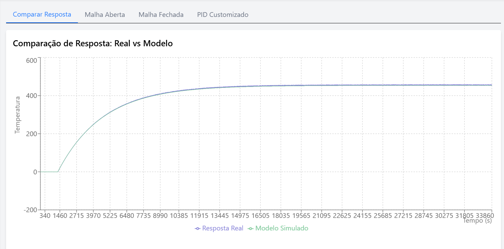
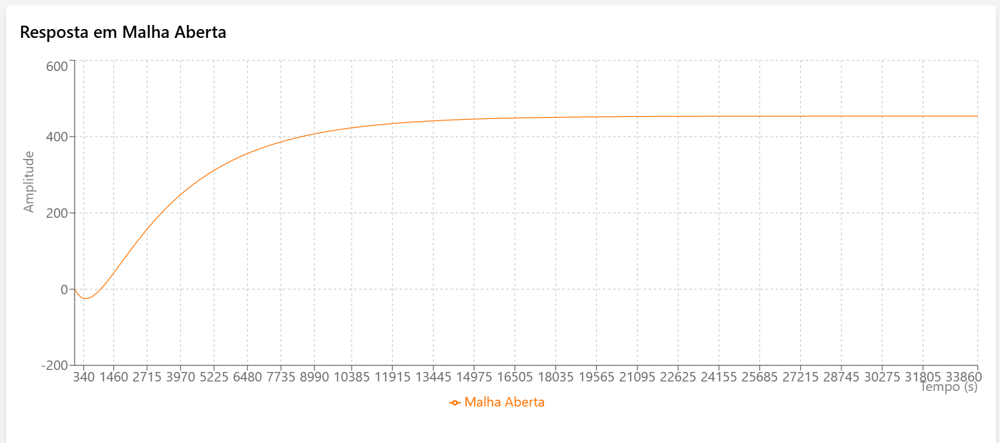
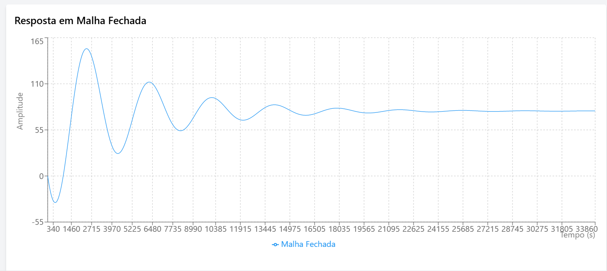
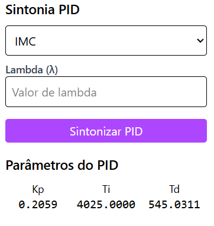
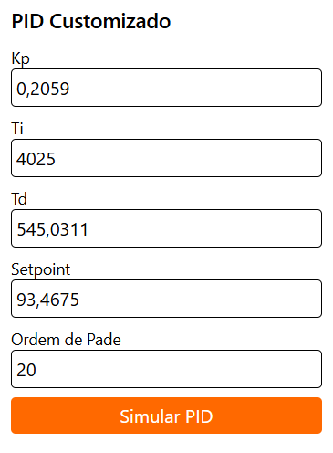
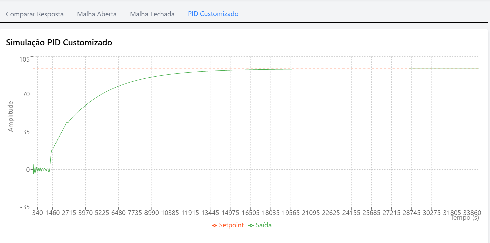

# C213 Controle PID

## Sobre o Projeto

Este projeto implementa um sistema de identificação e controle de sistemas PID, desenvolvido como parte da disciplina C213 - Sistemas embarcados.

A aplicação permite a importação de um dataset e exibição dos gráficos de comparação entre o sinal real e o identificado, além da resposta em malha aberta, resposta em malha fechada e simulação de um PID com parâmetros customizados.

## Tecnologias Utilizadas

- **Frontend**: React com Vite
- **Backend**: FastAPI
- **Controle PID**: [Python-Control](https://python-control.readthedocs.io/en/0.10.1/)

## Estrutura do Projeto

```
c213-control-pid/
│
├── app/api
│         ├── main.py
│         ├── routes.py
│         └── services.py
├── dataset
│         └── Dataset_Grupo5.mat
├── frontend/control-pid
│                      ├── src
│                      │     ├── components
│                      │     │            └── PIDControlSystem.jsx
│                      │     ├── App.css
│                      │     ├── App.jsx
│                      │     ├── index.css
│                      │     └── App.jsx
│                      │
│                      ├── eslint.config.js
│                      ├── index.html
│                      ├── package-lock.json
│                      ├── package.json
│                      ├── tailwind.config.js
│                      └── vite.config.js
├── .gitignore
├── README.md
└── requirements.txt
```

## Como Usar

### OPÇÃO 1 - RECOMENDADO

1. Acessar o link do projeto: [https://c213-control-pid.vercel.app/](https://c213-control-pid.vercel.app/)

   

2. Importar o Dataset:

   

3. Selecionar o modelo (Smith ou Sundaresan) e clicar em "Identificar Modelo":

   

4. Com isso, serão calculados os parâmetros K, τ e θ. Além disso, as seguintes telas serão liberadas:

   - **Comparar Resposta** - Exibe o gráfico com as curvas da saída real e simulada.

     

   - **Malha Aberta** - Exibe a resposta para a entrada em Malha Aberta.

     

   - **Malha Fechada** - Exibe a resposta para a entrada em Malha Fechada.

     

5. Na sequência, é possível escolher o modelo (IMC ou ITAE) e realizar a sintonia. Para o IMC, o parâmetro λ é opcional.

   

6. Com isso, a seção PID Customizado será preenchida com os valores de Kp, Ti e Td. É possível fazer ajustes nesses valores, além do Setpoint e da Ordem de Pade.

   

7. Ao selecionar Simular PID, será gerado o gráfico com os parâmetros escolhidos.

   

### OPÇÃO 2 - Executar localmente

### Pré-requisitos

- Navegador web (Chrome, Firefox, Safari, Edge)
- Python 3.10+ (para executar o backend)

### Instalação e Execução

1. Clone o repositório:

   ```bash
   git clone https://github.com/mathzpereira/c115-client-server-chatbot.git
   ```

2. Navegue até o diretório do projeto:

   ```bash
   cd c213-control-pid
   ```

3. Crie um ambiente virtual:

   ```bash
   python -m venv venv
   ```

4. Acesse o ambiente virtual criado:

- Windows:

  ```bash
  venv/Scripts/activate
  ```

- Linux/macOS:

  ```bash
  source venv/bin/activate
  ```

5. Instale as dependências do backend:

   ```bash
   pip install -r requirements.txt
   ```

6. Execute o backend:

   ```bash
   python app/api/main.py
   ```

7. Em outro terminal, navegue até a pasta do frontend:

   ```bash
   cd frontend/control-pid
   ```

8. Instale as dependências:

   ```bash
   npm install
   ```

9. Execute o frontend:
   ```bash
   npm run dev
   ```

## Autor

### Matheus Pereira - [GitHub](https://github.com/mathzpereira)
